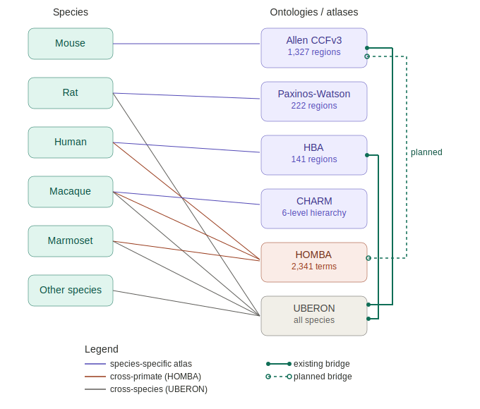

# Brain area ingestion for DANDI

## Goals

Neurophysiology datasets on DANDI describe recording locations using brain region labels, but these labels are inconsistent across labs, species, and naming conventions. One lab might label an electrode location "CA1", another "hippocampus", another "field CA1 of hippocampal formation." This inconsistency makes it difficult to search for, aggregate, and compare datasets across groups.

The goal of this work is to establish a controlled set of ontologies and atlases for describing brain anatomy in DANDI, so that:

1. **Consistent naming.** The same brain region is always identified the same way, regardless of how the researcher originally labeled it.
2. **Cross-species queries.** A user searching for "hippocampus" finds datasets from mice, macaques, and humans, even though the species-specific atlas terms differ.
3. **Integration with the DANDI Atlas Explorer.** Resolved brain regions link to spatial data (volumetric parcellations, surface meshes) so that datasets can be visualized in 3D atlas space at [atlas.dandiarchive.org](https://atlas.dandiarchive.org).

Choosing the right systems is a prerequisite for all downstream tooling. Once the ontology strategy is established, it will inform not only dandi-cli's metadata extraction (which attempts to resolve free-text labels after the fact), but also NWB conversion tools like NeuroConv, which can offer researchers controlled term selection earlier in the pipeline, at the point of data conversion. The long-term vision is that researchers select from standardized ontology terms during data preparation rather than relying entirely on post-hoc free-text matching at upload time.

## Landscape of available systems

There is no single ontology or atlas that meets all of DANDI's needs. The relevant systems fall into two categories: species-specific atlases (which have spatial data but limited interoperability) and cross-species ontologies (which enable interoperability but lack spatial data). The sections below describe each system and its strengths and limitations.

### Allen Mouse Brain CCFv3

The Allen Mouse Brain Common Coordinate Framework version 3 (CCFv3) is the standard reference atlas for the adult mouse brain. It parcellates the entire brain into ~1,327 structures at 10 um isotropic voxel resolution, using the ARA (Allen Reference Atlas) ontology for naming.

**Strengths:**

- Complete whole-brain volumetric parcellation
- Pre-built surface meshes (.obj) for every structure, hosted by the Allen Institute and used by the DANDI Atlas Explorer today
- Hierarchical ontology with well-established abbreviations (e.g., VISp, CA1, MOp)
- Formal UBERON bridge exists (`uberon-bridge-to-mba.owl`), enabling cross-species mapping
- Widely adopted in the mouse neurophysiology community; most mouse datasets on DANDI already use CCFv3 terminology
- MBA terms have resolvable URIs via OBO PURLs (e.g., `purl.obolibrary.org/obo/MBA_997`) and BICAN has created an ontologized version (MBAO) with persistent URLs

**Limitations:**

- Mouse only
- Uses its own ontology (not HOMBA); no formal mapping to HOMBA exists yet

### UBERON

UBERON is a cross-species anatomy ontology maintained by the OBO Foundry. It covers anatomical structures across all metazoa (not just the nervous system), with ~2,400 terms descending from "nervous system." UBERON is species-neutral by design: it defines generic structures like "hippocampal formation" or "primary motor cortex" without committing to any particular species' parcellation.

**Strengths:**

- Covers all species, making it the only option for organisms without a species-specific brain atlas
- Resolvable URIs via the OBO PURL system (e.g., `purl.obolibrary.org/obo/UBERON_0001954` for Ammon's horn)
- Formal bridge ontologies exist to the Allen Mouse Brain Atlas (`uberon-bridge-to-mba.owl`) and the Allen Human Brain Atlas (`uberon-bridge-to-aba.owl`)
- Well-established in the biomedical ontology ecosystem; used by ENCODE, Bgee, Phenoscape, and others
- Includes synonyms with scope annotations (EXACT, RELATED, NARROW, BROAD), useful for fuzzy matching

**Limitations:**

- No spatial data whatsoever (no volumetric parcellations, no surface meshes)
- Coarser-grained than species-specific atlases for well-studied species
- No bridge to HOMBA or to macaque atlases (D99, NMT, CHARM, MEBRAINS)
- Not designed specifically for neuroanatomy; brain regions are a subset of a much larger anatomy ontology

### HOMBA

The Harmonized Ontology of Mammalian Brain Anatomy (HOMBA) is a cross-species brain anatomy taxonomy developed by the Allen Institute as part of the BRAIN Initiative Cell Atlas Network (BICAN). It defines ~2,341 brain and spinal cord structures in a single unified hierarchy, with terminology harmonized across human, macaque, marmoset, and (planned) mouse.

HOMBA was derived from the Allen Developing Human Brain Atlas (DHBA) ontology and is used to annotate the CCF-MAP primate atlases.

**Strengths:**

- Cross-species harmonization across primates, with mouse harmonization planned
- Fine-grained hierarchy (2,341 terms), much more detailed than UBERON for brain regions
- Used by the HMBA consortium to annotate human (DHBAv2), macaque, and marmoset atlas volumes
- Designed specifically for neuroanatomical applications

**Limitations:**

- No resolvable URIs; terms are identified by numeric IDs in a CSV file (e.g., `HOMBA:10155` for "brain") with no web-resolvable address
- Not registered in OBO Foundry or any standard ontology registry
- No bridge to UBERON
- Mouse support has not yet shipped (Allen Institute has stated this is planned for future releases)
- Spatial data is limited: whole-brain volumetric parcellation exists for human (via DHBAv2) but only basal ganglia parcellation exists for macaque and marmoset as of the 2025 release
- No surface meshes
- Only version available is v1 ("WORKING" status)

### CHARM (Cortical Hierarchy Atlas of the Rhesus Macaque)

CHARM is a hierarchical cortical parcellation for the rhesus macaque, developed by the NIMH and distributed with the NMT v2 template. It provides six levels of increasingly fine-grained cortical parcellation, with the finest level derived from the D99 atlas. The companion SARM (Subcortical Atlas of the Rhesus Macaque) covers subcortical structures. Together, CHARM + SARM provide a complete whole-brain macaque parcellation.

**Strengths:**

- Complete cortical parcellation (149 regions at finest level, derived from D99) plus subcortical coverage via SARM
- Six-level hierarchy enables analysis at multiple spatial scales
- Registered to the NMT v2 population template, which has GIFTI surface files
- Spatial registrations exist between NMT v2 and many other macaque templates (D99, F99, Yerkes19, INIA19, MEBRAINS)
- Actively maintained by the AFNI/NIMH group

**Limitations:**

- Macaque only
- No formal ontology representation (no OWL/OBO files, no UBERON bridge, no resolvable URIs)
- Uses its own naming conventions (derived from D99/Saleem & Logothetis); no formal mapping to HOMBA or UBERON
- Surface meshes are in GIFTI format (not .obj), requiring conversion for web-based viewers

### WHS (Waxholm Space Atlas of the Sprague Dawley Rat Brain)

The Waxholm Space Atlas is the primary open, digital, volumetric atlas for the rat brain, developed by the International Neuroinformatics Coordinating Facility (INCF) and hosted at the Norwegian University of Science and Technology (NTNU). It provides a standardized reference space based on high-resolution MRI of the Sprague Dawley rat brain. The atlas uses nomenclature compatible with the Paxinos-Watson atlas ("The Rat Brain in Stereotaxic Coordinates"), the de facto standard for rat neuroanatomy.

**Strengths:**

- Whole-brain volumetric parcellation (222 labeled regions in v4) at 39 µm isotropic resolution
- Open access (CC-BY-SA) via NITRC and EBRAINS
- Uses Paxinos-Watson-compatible nomenclature (7th edition), the community standard for rat
- Available through BrainGlobe's atlas API for programmatic access
- Actively maintained with progressive refinement (v1 2014 → v4 2023)

**Limitations:**

- Rat only
- No formal ontology representation (no OWL/OBO files, no resolvable URIs for individual regions)
- No UBERON bridge
- Fewer regions (222) than the full Paxinos-Watson nomenclature (~800+ structures)
- Surface meshes not prominently distributed (available via third-party tools like BrainGlobe or 3D Slicer)

### HBA / HBAO (Allen Human Brain Atlas Ontology)

The Allen Human Brain Atlas (HBA) defines ~141 brain structures used to annotate the Allen Human Reference Atlas - 3D (2020), a whole-brain volumetric parcellation of the MNI152 template. The BICAN project has ontologized HBA as HBAO, providing OWL/OBO files, resolvable persistent URIs, and UBERON mappings.

**Strengths:**

- Whole-brain volumetric parcellation (141 regions in MNI152 space)
- Resolvable persistent URIs via BICAN (`purl.brain-bican.org/ontology/hbao/HBA_XXXX`)
- Registered on the Ontology Lookup Service (OLS) for browsing and search
- Formal UBERON bridge (`uberon-bridge-to-aba.owl`)
- Each term links directly to the corresponding region in the Allen Human Brain Guide atlas viewer

**Limitations:**

- Human only
- Relatively coarse (141 regions) compared to HOMBA (2,341 terms) or DHBAv2
- Separate ontology from HOMBA; HBA was derived from the Allen Human Reference Atlas, while HOMBA was derived from DHBA. There is no formal mapping between them
- No surface meshes

## Strategy

Given that no single system covers all of DANDI's needs, we adopt a layered approach where each dataset stores the most specific identifiers available for its species. The guiding principles are:

- Store species-specific atlas IDs where they exist (these link to spatial data and fine-grained parcellations).
- Store HOMBA IDs for primates (these enable cross-primate queries).
- Store UBERON IDs only when no species-specific atlas with a UBERON bridge is available (since UBERON IDs can be derived on the fly via bridge ontologies for mouse and human).
- Only store what you cannot derive.

The per-species strategy is:

**Mouse:** Store CCFv3 IDs. UBERON IDs can be derived via the existing `uberon-bridge-to-mba.owl` bridge when needed for cross-species queries.

**Macaque:** Store CHARM IDs + HOMBA IDs + UBERON IDs. All three are stored explicitly because no formal bridges exist between them. CHARM provides the link to spatial data (NMT v2 parcellation and surfaces). HOMBA enables alignment with other primate species. UBERON enables cross-species queries.

**Marmoset:** Store HOMBA IDs + UBERON IDs. Several whole-brain marmoset atlases exist with volumetric parcellations and surfaces (Brain/MINDS BMA2.0 with 323 regions per hemisphere, MBM V3 with FreeSurfer/SUMA surfaces), but none have been ontologized or bridged to UBERON. As marmoset-specific atlas support matures, a species-specific atlas ID could be added alongside HOMBA and UBERON, similar to the macaque strategy with CHARM.

**Rat:** Store WHS atlas IDs + UBERON IDs. The WHS atlas (v4) provides the volumetric parcellation using Paxinos-Watson-compatible nomenclature. Both IDs are stored explicitly because no formal bridge exists between WHS and UBERON. HOMBA does not currently include rat.

**Human:** Store HBA IDs + HOMBA IDs. UBERON IDs can be derived from HBA via the existing `uberon-bridge-to-aba.owl` bridge. HOMBA provides finer-grained localization (2,341 vs. 141 terms) and cross-primate alignment. If a term is more specific than what HBA covers but is present in UBERON, store the UBERON ID alongside HBA.

**All other species:** Store UBERON IDs. As species-specific atlases become available (e.g., via BrainGlobe), add support for storing their IDs alongside UBERON.

## Roll-out plan for dandi-cli

Implementation proceeds in five phases, each adding support for one ontology layer. Each phase is independently useful and builds on the previous one.

### Phase 1: Allen Mouse Brain Atlas (CCFv3)

This is largely complete (see [dandi-cli PR #1825](https://github.com/dandi/dandi-cli/pull/1825) and its parent branch). The implementation matches free-text brain region labels from NWB electrode and imaging metadata against the Allen CCFv3 ontology.

**Scope:**

- Load the Allen CCFv3 structure tree (available via the Allen API or bundled JSON)
- Match input location strings against structure names and acronyms
- For mouse datasets, resolve each brain region label to an Allen CCFv3 structure ID
- Store the resolved CCFv3 ID in the dandiset metadata

**Status:** In progress. The existing implementation on the `add-brain-area-anatomy` branch handles Allen CCFv3 matching for mouse.

### Phase 2: WHS Rat Brain Atlas

Add WHS-based matching for rat datasets, analogous to CCFv3 for mouse.

**Scope:**

- Bundle the WHS v4 region lookup table (available from NITRC or via BrainGlobe)
- Match input location strings against WHS region names and abbreviations (Paxinos-Watson-compatible nomenclature)
- For rat datasets, resolve each brain region label to a WHS region ID
- Store the resolved WHS ID in the dandiset metadata

**Outcome:** After this phase, rat datasets carry WHS IDs that link to a whole-brain volumetric parcellation, enabling visualization in a future multi-species DANDI Atlas Explorer.

### Phase 3: UBERON

Add UBERON-based matching as a fallback for all species.

**Scope:**

- Bundle a compact JSON of UBERON nervous system descendants (~2,400 terms with synonyms), generated from the UBERON OBO file (see `generate_uberon_structures.py` in PR #1825)
- For mouse, attempt CCFv3 matching first (phase 1); if no match is found, fall back to UBERON
- For all other species, attempt to match input location strings against UBERON term names and synonyms directly
- Use tiered synonym matching: try exact matches first, then narrow, then broad, then related
- Store the resolved UBERON ID (with resolvable `purl.obolibrary.org` URI) in the dandiset metadata

**Outcome:** After this phase, every species on DANDI can get at least a coarse brain region annotation. Mouse uses CCFv3 (phase 1); everything else uses UBERON.

### Phase 4: HOMBA

Add HOMBA-based matching for primate species (human, macaque, marmoset).

**Scope:**

- Bundle the HOMBA v1 terminology CSV (available from the CCF-MAP repository)
- For human, macaque, and marmoset datasets, attempt to match input location strings against HOMBA term names and acronyms
- Store the resolved HOMBA ID alongside any other IDs already resolved (UBERON for macaque, HBA for human once phase 5 is complete)
- Note: HOMBA IDs are not currently URI-resolvable. If the Allen Institute or BICAN publish resolvable URIs for HOMBA in the future, update the stored identifiers accordingly

**Outcome:** After this phase, primate datasets carry HOMBA IDs that enable cross-primate queries (e.g., "find all datasets recording from caudate nucleus in any primate species").

### Phase 5: CHARM

Add CHARM-based matching for macaque datasets, linking them to the NMT v2 spatial data.

**Scope:**

- Bundle or reference the CHARM region table (available from the AFNI distribution)
- For macaque datasets, attempt to match input location strings against CHARM region names and abbreviations at all six hierarchy levels
- Store the resolved CHARM region ID alongside the HOMBA and UBERON IDs from phases 3-4
- Investigate feasibility of rendering NMT v2 GIFTI surfaces in the DANDI Atlas Explorer (requires GIFTI-to-OBJ or GIFTI-to-glTF conversion)

**Outcome:** After this phase, macaque datasets carry CHARM IDs that link to a whole-brain spatial parcellation, enabling visualization in a future multi-species DANDI Atlas Explorer.

### Phase 6: HBA

Add HBA-based matching for human datasets, providing UBERON-bridged identifiers with resolvable URIs.

**Scope:**

- Bundle or reference the HBAO ontology (available from the brain-bican/human_brain_atlas_ontology repository)
- For human datasets, attempt to match input location strings against HBA structure names
- Store the resolved HBA ID (with resolvable `purl.brain-bican.org` URI) alongside the HOMBA ID from phase 4
- UBERON IDs can be derived from HBA via the existing bridge, so they are not stored explicitly unless the term is more specific than HBA's 141 regions

**Outcome:** After this phase, human datasets carry HBA IDs with resolvable URIs and UBERON interoperability, plus HOMBA IDs for cross-primate alignment. For the DANDI Atlas Explorer, the DHBAv2 volumetric parcellation (which uses HOMBA terms) provides a finer-grained basis for rendering than HBA's 141 regions.

## Roll-out plan for NeuroConv and NWB tooling

Rather than phasing NeuroConv support by ontology, the approach is to build unified tooling that works across all ontologies from the start, provide clear documentation on which ontologies to use for which species, and add validation checks to catch missing or incorrect annotations.

### Unified search and validation library

Build a shared Python library (usable by NeuroConv, NWB GUIDE, and NWB Inspector) that provides:

- A unified search function across all supported ontologies (CCFv3, WHS, UBERON, HOMBA, CHARM, HBA). Given a brain region string and a species, the function returns matches from all applicable ontologies ranked by specificity, along with their IDs and URIs.
- A validation function that checks whether a brain region string resolves to at least one term in the recommended ontologies for the dataset's species. Returns warnings for unmatched terms with suggested close matches.
- A HERD writer that takes resolved ontology matches and writes them into an NWB file's HERD structure, associating electrode or imaging plane location fields with the appropriate external resource entries.

This library can be used programmatically in NeuroConv conversion scripts, interactively in notebooks, and as a backend for the NWB GUIDE searchable dropdown.

### Documentation

Publish clear guidance on which ontologies to use for each species, following the strategy outlined in this document:

- Mouse: CCFv3
- Rat: WHS + UBERON
- Macaque: CHARM + HOMBA + UBERON
- Marmoset: HOMBA + UBERON
- Human: HBA + HOMBA (+ UBERON if more specific than HBA)
- Other species: UBERON

This documentation should live alongside NeuroConv's existing metadata guidance and be referenced from NWB best practices.

### NWB Inspector checks

Add checks to NWB Inspector that validate brain region annotations against the recommended ontologies:

- Warn if electrode or imaging plane location fields contain free-text strings that are not associated with any ontology term via HERD.
- Warn if HERD entries exist but do not include the recommended ontologies for the dataset's species (e.g., a mouse dataset with a UBERON entry but no CCFv3 entry).
- Warn if HERD entries reference ontology URIs that do not resolve or use unexpected prefixes.

These checks encourage researchers to use the unified search/validation tools during conversion and ensure that datasets uploaded to DANDI carry the ontology annotations needed for cross-species queries and atlas visualization.

## Roll-out plan for DANDI Atlas Explorer

The DANDI Atlas Explorer ([atlas.dandiarchive.org](https://atlas.dandiarchive.org)) currently renders Allen CCFv3 surface meshes for the mouse brain, with DANDI datasets plotted by brain region. Extending it to other species requires both mesh assets and a mapping from ontology IDs to renderable geometry. The roll-out follows the same species priority order as dandi-cli.

### Phase 1: Mouse (current)

The atlas viewer already renders Allen CCFv3 mouse brain regions using pre-built .obj meshes fetched from the Allen Institute. Datasets with resolved CCFv3 IDs (from dandi-cli phase 1) are plotted in 3D atlas space. No additional work is needed for mouse.

### Phase 2: Human

Two volumetric parcellations are available for the human brain. HBA provides a coarse whole-brain parcellation (141 regions in MNI152 space), while DHBAv2 provides a much finer-grained whole-brain parcellation using HOMBA terminology in the same MNI152 space. Surface meshes can be generated from either annotation volume using marching cubes. The DHBAv2/HOMBA parcellation is preferable for rendering given its higher granularity, and datasets with resolved HOMBA IDs (from dandi-cli phase 4) or HBA IDs (from dandi-cli phase 6) can be plotted. Using the HOMBA parcellation for rendering also aligns the human atlas viewer with the eventual macaque and marmoset HOMBA parcellations as they become available.

### Phase 3: Rat

The WHS v4 atlas provides a whole-brain volumetric parcellation (NIfTI) at 39 µm resolution. Surface meshes can be generated from the label volume or obtained via BrainGlobe/3D Slicer. Datasets with resolved WHS IDs (from dandi-cli phase 2) can be plotted. The format conversion needs are similar to macaque (NIfTI/GIFTI to web-friendly .obj or glTF).

### Phase 4: Macaque

NMT v2 provides GIFTI surface files for the macaque brain, with CHARM parcellation labels. The GIFTI surfaces need to be converted to a web-friendly format (.obj or glTF). Each surface region is keyed to a CHARM region ID, and datasets with resolved CHARM IDs (from dandi-cli phase 5) can be plotted. The D99 v2 atlas (368 regions) registered to NMT v2 space provides finer-grained parcellation if needed.

### Phase 5: Marmoset

Several marmoset atlases provide surface meshes. The Brain/MINDS BMA2.0 includes pial, mid-thickness, and white matter surfaces with a 323-region whole-brain parcellation. The MBM V3 also provides FreeSurfer and SUMA-compatible surfaces. As with macaque, surface conversion and a mapping from atlas region IDs to renderable geometry is needed. Marmoset atlas support in DANDI Atlas is lower priority given the smaller number of marmoset datasets on DANDI, but the assets exist when demand warrants it.

### Phase 6: Cross-species views

Once multiple species are supported, the atlas viewer can offer cross-species query views. A user searching for "hippocampus" would see matching datasets across species, with each species rendering in its own atlas space. UBERON IDs (derived or stored) provide the glue: the viewer maps a UBERON term to the corresponding species-specific atlas region ID (CCFv3 for mouse, WHS for rat, HBA for human, CHARM for macaque) and highlights the appropriate mesh in each species' atlas.

## Open questions and future work

- **HOMBA URIs.** HOMBA terms currently lack resolvable URIs, which limits their utility as stable identifiers. This should be raised with the Allen Institute and the BICAN community. A treatment similar to what BICAN did for HBA (creating HBAO with persistent PURLs) would be ideal.
- **HOMBA-UBERON bridge.** No mapping exists between HOMBA and UBERON. Building one (even a partial mapping at coarse granularity) would close the gap for primate species and reduce the number of IDs that need to be stored explicitly for macaque.
- **HOMBA mouse support.** The Allen Institute has stated that HOMBA will eventually include harmonized mouse terminology, but this has not shipped. Once available, it would enable cross-species alignment between mouse and primate datasets via HOMBA, complementing the existing UBERON bridges.
- **CHARM-UBERON bridge.** No formal mapping exists. A pragmatic approach using name matching between CHARM region names and UBERON terms could provide partial coverage.
- **WHS ontologization.** The WHS rat atlas lacks formal ontology infrastructure (no OWL/OBO, no resolvable URIs, no UBERON bridge). Creating resolvable identifiers for WHS regions and a UBERON bridge would bring rat to parity with mouse (CCFv3). The Paxinos-Watson nomenclature used by WHS is proprietary, which may complicate formal ontologization.
- **Mesh generation and hosting.** Pre-built .obj meshes only exist for mouse (Allen CCFv3). For human, macaque, and marmoset, meshes need to be generated from volumetric parcellations or converted from GIFTI format. A hosting solution for these derived meshes (similar to how Allen hosts mouse meshes) is needed.
- **Matching ambiguity.** Many brain region names are shared across species at coarse granularity ("hippocampus", "thalamus") but diverge at finer levels. The matching logic should use species context from the NWB file to select the appropriate ontology and avoid false matches.
- **Multiple matches.** A single free-text label may match terms in multiple ontologies at different levels of specificity. The system should store the most specific match available in each applicable ontology layer.
