# DOI for Draft Dandisets

Authors: Yaroslav O. Halchenko, Dorota Jarecka, Austin Macdonald

## Overview

This document describes an updated strategy for DOI management within the Dandi Archive.
Upon creation, every public Dandiset will receive a **Dandiset DOI** that will represent the current draft and all future versions.
Every public published version of a Dandiset will recieve a **Version DOI**.

For example:
Dandiset DOI: `https://doi.org/10.48324/dandi.000027/`
Version DOI: `https://doi.org/10.48324/dandi.000027/0.210831.2033`

Prior to publication, the Dandiset DOI will refer to the latest draft version.
Following publication, the Dandiset DOI will refer to the latest published version.

At creation the `Dandiset DOI` will be a DataCite `Draft DOI`, but will be "promoted" to a DataCite `Findable DOI` as soon as possible.
`Version DOI` will always be a `Findable DOI`.

## The current approach

- [initial design doc](./doi-generation-1.md)
- overall:
   - leave DOI absent upon dandiset creation
   - upon publication
      - inject fake DOI (but do not save) and validate
      - after validation, create a new `Version DOI` (function `create_doi`)
      - publish dandiset

### Issues with the Existing Approach

- [Stop injecting "fake" DOIs into draft dandisets](https://github.com/dandi/dandi-archive/issues/1709)
- [Unpublished Dandisets display a DOI under `Cite As`](https://github.com/dandi/dandi-archive/issues/1932)

## Proposed Solution

Initially proposed/discussed in

- [Create and maintain a "Findable" DOI for the Dandiset as a whole](https://github.com/dandi/dandi-archive/issues/1319)

and boils down to the adoption of approach of Zenodo of having a DOI which always points to the latest version of the record.
[Zenodo uses the language](https://support.zenodo.org/help/en-gb/1-upload-deposit/97-what-is-doi-versioning) `Concept DOI` to mean a top-level DOI that references all versions, which we will refer to as `Dandiset DOI`.

DataCite allows for three types of DOIs ([DataCite](https://support.datacite.org/docs/what-does-the-state-of-the-doi-mean)):

- `Draft`. We do not use those.
  *Can be deleted, and they require only the identifier itself in order to be created or saved. They can be updated to either Registered or Findable DOIs. Registered and Findable DOIs may not be returned to the Draft state, which means that changing the state of a Draft is final.*
- `Registered`. Like `Findable` but not indexed for search, so we do not use them.
- `Findable`. Is the type we use for published dandisets.
  Requires to be valid (pass validation to fit the datacite schema) to be created.

We propose to:

- Upon creation of a **public** dandiset, mint a `Dandiset DOI` (a DataCite `Draft DOI`) `10.48324/dandi.{dandiset.id}` with
  - *minimal metadata* entered during creation request (title, description, license)
  - DLP URL `https://dandiarchive.org/dandiset/{dandiset.id}`
  - For embargoed dandiset, **do not** specify any metadata besides the DLP URL.
  - If minting a DOI fails, we need to raise exception to inform developers about the issue but proceed with the creation of the dandiset.
- Upon changes to a non-embargoed, draft dandiset metadata record:
  - If `Draft DOI`, attempt to "promote" it to `Findable`.
    - If validation fails - keep `Draft DOI` (very limited validation), attempt to update datacite metadata record while keeping the same target URL.
    - **Question to clear up**: what happens to `Draft DOI` if metadata record is invalid? It seems to create one with no metadata, but does it update only the fields it knows about?
  - If `Findable DOI`
    - if draft version with no prior publications, but which had legit metadata, we try to update metadata.
      - **Question to clear up** If fails, we either ignore or just add a comment somewhere that "record might not reflect the most recent changes to draft version".
      - **Question to clear up** If we add to validation procedures to dandiset updates, (validation against datacite metadata record), we can report errors to the user so they can be addressed prior to attempted publication. May be we should validate only if no other errors (our schema validation) were detected to reduce noise, or just give a summary that "Metadata is not satisfying datacite model, fix known metadata errors first."
    - if dandiset was published at least once (has version) -- we do not update anything since DLP points to that published version.
  - **TODO: figure out how to annotate Draft version, so it always says that it is a draft version and thus potentially not used for citation if that could be avoided**
- Upon changes to embargoed dandiset metadata record, don't do anything.
- Upon unembargoing dandiset: update `Draft DOI` metadata record with current metadata and attempt to promote to a `Findable DOI` **after** unembargoing.
- Upon publication of the dandiset:
  - (already done currently) mint a proper `Findable` `Version DOI`, ie `10.48324/dandi.{dandiset.id}/{version}`
  - update `Dandiset DOI` `10.48324/dandi.{dandiset.id}` with metadata provided for the `Version DOI`, **while keeping URL pointing to DLP instead of the released version**.
    - if `Dandiset DOI` was a `Draft DOI` state, promote to `Findable DOI` (should work since we know metadata record passed validation).
       - **Question to clear up**:how to do that in API
    - **Question to clear up**: behavior on what happens if metadata record is invalid?

### Sequence Diagram

```mermaid
sequenceDiagram
    participant User
    participant DandiArchive as Dandi Archive
    participant DataCite

    Note over User,DataCite: Public Dandiset Creation
    User->>DandiArchive: Create public dandiset
    DandiArchive->>DataCite: Mint Dandiset DOI (Draft) (10.48324/dandi.{id})
    Note right of DataCite: Minimal metadata + DLP URL
    alt DOI minting successful
        DataCite-->>DandiArchive: Return Dandiset DOI (Draft)
    else DOI minting fails
        DataCite-->>DandiArchive: Error
        Note right of DandiArchive: Log error but continue dandiset creation
    end
    DandiArchive-->>User: Return dandiset with or without Dandiset DOI

    Note over User,DataCite: Metadata Updates (Non-embargoed Draft)
    User->>DandiArchive: Update dandiset metadata
    alt No Dandiset DOI exists (previous mint failed)
        DandiArchive->>DataCite: Mint Dandiset DOI (Draft)
        DataCite-->>DandiArchive: Return Dandiset DOI (Draft)
        DandiArchive->>DataCite: Try to promote to Dandiset DOI (Findable)
        alt Validation successful
            DataCite-->>DandiArchive: Update to Dandiset DOI (Findable)
        else Validation fails
            DataCite-->>DandiArchive: Keep as Dandiset DOI (Draft)
        end
    else Dandiset DOI (Draft) exists
        DandiArchive->>DataCite: Try to promote to Dandiset DOI (Findable)
        alt Validation successful
            DataCite-->>DandiArchive: Update to Dandiset DOI (Findable)
        else Validation fails
            DataCite-->>DandiArchive: Keep as Dandiset DOI (Draft)
            DandiArchive->>DataCite: Update metadata record only
        end
    else Dandiset DOI (Findable) exists (no prior publications)
        DandiArchive->>DataCite: Update metadata
        alt Validation successful
            DataCite-->>DandiArchive: Update metadata
        else Validation fails
            DandiArchive-->>DandiArchive: Log error, continue
        end
    else Dandiset has published versions
        DandiArchive-->>DandiArchive: No DOI update (points to published version)
    end
    DandiArchive-->>User: Return updated dandiset

    Note over User,DataCite: Embargoed Dandiset Handling
    User->>DandiArchive: Create embargoed dandiset
    DandiArchive-->>DandiArchive: No DOI updates for embargoed dandisets
    User->>DandiArchive: Update embargoed dandiset
    DandiArchive-->>DandiArchive: No DOI updates for embargoed dandisets

    User->>DandiArchive: Unembargo dandiset
    DandiArchive->>DataCite: Request Draft DOI (minimal info)
    Note right of DataCite: Only DLP URL, no metadata
    DataCite-->>DandiArchive: Return Draft DOI
    DandiArchive->>DataCite: Try to promote to Dandiset DOI (Findable)
    alt Validation successful
        DataCite-->>DandiArchive: Update to Dandiset DOI (Findable)
    else Validation fails
        DataCite-->>DandiArchive: Keep as Dandiset DOI (Draft)
    end
    DandiArchive-->>User: Return unembargoed dandiset

    Note over User,DataCite: Dandiset Publication
    User->>DandiArchive: Publish dandiset
    alt Dandiset DOI is Draft
        DandiArchive->>DataCite: Promote to Dandiset DOI (Findable)
        DataCite-->>DandiArchive: Update to Dandiset DOI (Findable)
    else Already Findable
        DataCite-->>DandiArchive: Update metadata only
    end
    DandiArchive->>DataCite: Mint Version DOI (Findable) (10.48324/dandi.{id}/{version})
    DataCite-->>DandiArchive: Return Version DOI (Findable)
    DandiArchive->>DataCite: Update Dandiset DOI with version metadata
    Note right of DandiArchive: Keep URL pointing to DLP
    DandiArchive-->>User: Return published dandiset with both DOIs

    Note over User,DataCite: Dandiset Deletion (Optional)
    User->>DandiArchive: Delete dandiset
    DandiArchive->>DataCite: Update DOI to point to deletion page
    DataCite-->>DandiArchive: Update DOI target URL
    DandiArchive-->>User: Confirm deletion
```

### Migration

A django-admin script should be created and executed to create a `Dandiset DOI` for all existing dandisets.

**Question to address**: Will adding a `Dandiset DOI` in addition to `Version DOI` require a db migration?

## Concerns to keep in mind/address

- Draft dandiset might not have sufficient (or valid) metadata to promote to a `Findable` DOI, thus causing issues with minting a DOI
  - **Solution**: start with Draft (not findable) DOI, and then upon publication promote to a "findable" DOI.
  - **Follow up concern**: after dandiset and DOI publish, metadata of the Draft version of the dandiset could still be changed.
    This potentially making changed record again "invalid".
    Should be Ok'ish
- Test site of datacite had different result of validation that the primary one

- `Draft` DOI is not visible/usable by users. We might want to switch it to `Findable` as soon ASAP (when datacite validates record ok).
- `Findable` DOI cannot be deleted, but in principle we allow for deletion of dandisets.
  - Option 1: We might want a dedicated 404 page for deleted dandisets, then we adjust DOI record to point to that page.
  - Option 2: at least a message that the dandiset was deleted, and ideally describe the reason why it was deleted ("Upon request of maintainer", "Due to violation of terms of service", etc.)

- Should we do anything at dandischema level?
  - yes
    - Needs to be able to mint `Draft DOI`
    - Needs to be able to promote `Draft DOI` to `Findable DOI`
  - potentially model might need to change

- Should we do anything at DLP level?
    - We may want to include `Dandiset DOI` somewhere, in addition to the `Version DOI` which we currently use.

- Should we somehow reflect interactions with DataCite in Audit log? Possible things to log:
  - `Dandiset DOI`
    - Success/Fail creation of `Draft DOI`
    - Success/Fail promotion of `Draft DOI` to `Findable DOI` (Expected to fail if metadata is incomplete)
  - `Version DOI`
    - Success/Fail creation of `Findable DOI`

# Targets TODO before implementation

- develop a script, which tests on test fabric of datacite changes as introduced to all dandisets in the archive by
  - for each dandiset
    - generate a record for overall *dandiset DOI* corresponding to metadata of the first release if any exists, otherwise corresponding to metadata of the draft version
    - for each release: mint a new *version DOI* for that release + possibly update *dandiset DOI* to correspond to potential changes in metadata
    - update *dandiset DOI*  to metadata of draft version

