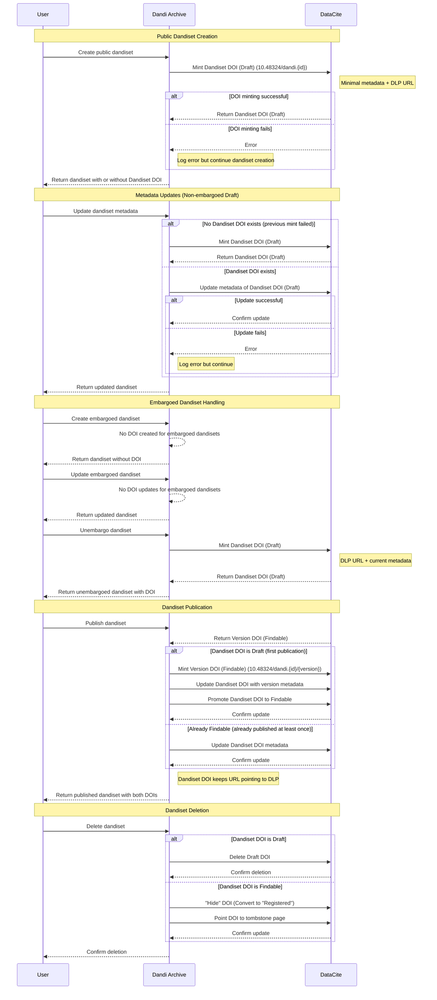

# DOI for Draft Dandisets

Authors: Yaroslav O. Halchenko, Dorota Jarecka, Austin Macdonald

## Overview

This document describes an updated strategy for DOI management within the Dandi Archive.
Upon creation, every public Dandiset will receive a **Dandiset DOI** that will represent the current draft and all future versions.
Every public published version of a Dandiset will receive a **Version DOI**.

For example:
Dandiset DOI: `https://doi.org/10.48324/dandi.000027/`
Version DOI: `https://doi.org/10.48324/dandi.000027/0.210831.2033`

The Dandiset DOI will always refer to the DLP

At creation the `Dandiset DOI` will be a DataCite `Draft DOI`, but will be "promoted" to a DataCite `Findable DOI` as soon as there is a published version.
A `Version DOI` will be created as a `Findable DOI`.

## The current approach

- [initial design doc](./doi-generation-1.md)
- overall:
   - leave DOI absent upon dandiset creation
   - upon publication
      - inject fake DOI (but do not save) and validate
      - after validation, create a new `Version DOI` (function `create_doi`)
      - publish dandiset

### Issues with the Existing Approach

- [Stop injecting "fake" DOIs into draft dandisets](https://github.com/dandi/dandi-archive/issues/1709)
- [Unpublished Dandisets display a DOI under `Cite As`](https://github.com/dandi/dandi-archive/issues/1932)

## Background

Initially proposed/discussed in

- [Create and maintain a "Findable" DOI for the Dandiset as a whole](https://github.com/dandi/dandi-archive/issues/1319)

and boils down to the adoption of approach of Zenodo of having a DOI which always points to the latest version of the record.
[Zenodo uses the language](https://support.zenodo.org/help/en-gb/1-upload-deposit/97-what-is-doi-versioning) `Concept DOI` to mean a top-level DOI that references all versions, which we will refer to as `Dandiset DOI`.

DataCite allows for three types of DOIs ([DataCite](https://support.datacite.org/docs/what-does-the-state-of-the-doi-mean)):

- `Draft`. We do not use those.
  *Can be deleted, and they require only the identifier itself in order to be created or saved. They can be updated to either Registered or Findable DOIs. Registered and Findable DOIs may not be returned to the Draft state, which means that changing the state of a Draft is final.*
- `Registered`. Like `Findable` but not indexed for search, so we do not use them.
- `Findable`. Is the type we use for published dandisets.
  Requires to be valid (pass validation to fit the datacite schema) to be created.

## Proposed Solution

- For **Public dandisets**:
    - Upon creation:
        - mint a `Dandiset DOI` (a DataCite `Draft DOI`) `10.48324/dandi.{dandiset.id}` with *minimal metadata* entered during creation request (title, description, license)
        - URL should point be DLP `https://dandiarchive.org/dandiset/{dandiset.id}`
        - If minting a DOI fails, we need to raise exception to inform developers about the issue but proceed with the creation of the dandiset.
    - Upon updates to a draft dandiset metadata **prior to first publication**:
        - Update the datacite metadata of the `Draft DOI`, (leave as draft)
        - If validation fails, log error and continue
    - Upon deletion of a draft dandiset metadata **prior to first publication**:
        - Delete the `Dandiset DOI` (Draft) from Datacite
    - Upon **first publication** of a dandiset:
        - Mint a new `Version DOI` (Findable) (already done currently), ie `10.48324/dandi.{dandiset.id}/{version}`
        - Update `Dandiset DOI` metadata to match published version
        - promote `Dandiset DOI` (Draft) to `Findable DOI`
    - Upon updates to draft dandiset metadata **after the first publication**"
        - no-op. The `Dandiset DOI` metadata will match the most recent publication.
    - Upon deletion of a published dandiset version (`VersionViewSet.destroy`) :
        - "hide" the `Version DOI` (Findable) to `Registered DOI`
    - Upon deletion of a dandiset (`DandisetViewSet.destroy`):
        - "hide"  the `Dandiset DOI`  if `Findable` and delete if `Draft`
    - Upon **subsequent publications** of a dandiset:
        - Mint a new `Version DOI`
        - Update `Dandiset DOI` metadata to match published version
- For **embargoed dandiset**:
    - Upon creation, no DOI is created.
    - Upon changes to embargoed dandiset metadata record, don't do anything.
    - Upon deletion of an embargoed dandiset: don't do anything.
    - Upon unembargoing dandiset:
        - Mint `Dandiset DOI` (Draft) with latest metadata,

### Cautions

If DANDI_DOI_PUBLISH is false (default)
    - creation as `Findable` should be disabled
    - update to `Findable` and `Registered` should be disabled

If all DOI configuration options are not set:
    - all required options:
        - `DANDI_DOI_API_URL`
        - `DANDI_DOI_API_URL`
        - `DANDI_DOI_API_PASSWORD`
        - `DANDI_DOI_API_PASSWORD`
    - DOIs CRUD through Datacite API should be entirely disabled
    - DOI (the string) should not be added to the version

### Sequence Diagram

### Migration

A django-admin script should be created and executed to create a `Dandiset DOI` for all existing dandisets.

No DB migration will be needed, as no new field will be added to `Dandiset` model, and
instead, the `Dandiset DOI` will be stored in the "draft" `Version`.

### Dandi Schema Changes

`dandi-schema` function `to_datacite` is currently only able to create a `Draft DOI` (`publish=True`) or create a `Findable DOI` (`publish=False`)

It will need to be extended to:
    - "publish" `Draft DOI` to `Findable DOI`
    - "hide" `Findable DOI` to `Registered DOI`
    - Produce `Dandiset DOI` and `Version DOI` (only does version DOI currently)

We will keep (and deprecate) the `publish` parameter, and add a new parameter `event` which is either:
    - (None): Draft DOI
    - `publish`: Findable DOI
    - `hide`: Registered DOI

In the current implementation, only published dandisets are given a DOI, so we are using the pydantic validation for `PublishedDandiset`.
This is too restrictive for our case.
Instead, we'll try `PublishedDandiset` first, then fallback to `Dandiset`, then fall back to unvalidated.

## Alternatives Explored

#### Prevent Findable DOIs when not validated

If we fallback to unvalidated, we could prevent the DOI from becoming findable.
Instead though, we've opted to just try to update the DOI via Datacite anyway and handle the API failure if it happens.

### Creating DOIs for Embargoed Dandisets

We opted not to create DOIs for embargoed Dandisets because:
 - We own the prefix, and so there is no need to "reserve"
 - We should avoid sending any potentially secret metadata to a 3rd party, even if it is not publicly searchable.
 - If we were to create a DOI with fake metadata that probably would not have any value at all.
 - What the DOIs will eventually be upon publication is semantically determined, so the value can be used even prior to being "real".

 We might reconsider, if decision would be made to expose metadata of Embargoed Dandisets for the purpose of discovery.

### Promoting Draft DOIs to Findable for Draft Dandisets

There might be some value in having a `Findable DOI` (Version DOI and/or Dandiset DOI) that points to the draft version of a Dandiset.
This is because `Draft` DOI is not visible/usable by users.

However, if we promote the `Draft DOI` to `Findable` as soon as it is valid, and the user then change it to be invalid again, the DOI metadata will be wrong.
We discussed annotating the DOI, ie "potentially incorrect metadata", but we ultimately decided that the messiness is not worth the value.

- Dandisets can be deleted. In such cases, upon deletion of a dandiset:
  - if DOI was a `Draft` DOI - just delete it as well.
  - if DOI was a `Findable` DOI - convert to `Registered` DOI (follows [datacite best practices](https://support.datacite.org/docs/tombstone-pages))
  - Also at the level of the DANDI archive itself we should provide tombstone page so URL is still "working" (#3211)
  - If no tombstone page support added, just adjusted URL in datacite record to point to https://www.datacite.org/invalid.html

## Concerns to keep in mind/address

- **Question to clear up**: what happens to `Draft DOI` if metadata record is invalid?
    - It seems to create one with no metadata, but does it update only the fields it knows about?
- **Question to clear up** If we add to validation procedures to dandiset updates, (validation against datacite metadata record), we can report errors to the user so they can be addressed prior to attempted publication. May be we should validate only if no other errors (our schema validation) were detected to reduce noise, or just give a summary that "Metadata is not satisfying datacite model, fix known metadata errors first."
- **TODO: figure out how to annotate Draft version, so it always says that it is a draft version and thus potentially not used for citation if that could be avoided**
    - We do not need to annotate `Draft DOI` metadata since it is not visible.
    - If the `Dandiset DOI` is visible on the Draft Dandiset page, we should consider changing the "Cite As" or add an additional field.
    - Zenodo's "Concept DOIs" are presented as "Cite all versions" but we didn't think this was clear enough.
- We may want to include `Dandiset DOI` somewhere on published versions too, in addition to the `Version DOI` which we currently use.
    - The "Draft Dandiset" Version will be populated with `Dandiset DOI`, so this may not be necessary.
- Should we somehow reflect interactions with DataCite in Audit log? Possible things to log:
  - `Dandiset DOI`
    - Success/Fail creation of `Draft DOI`
    - Success/Fail promotion of `Draft DOI` to `Findable DOI` (Expected to fail if metadata is incomplete)
  - `Version DOI`
    - Success/Fail creation of `Findable DOI`
