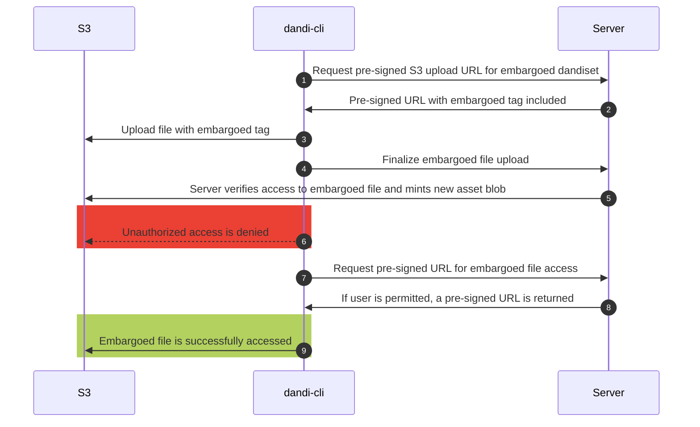
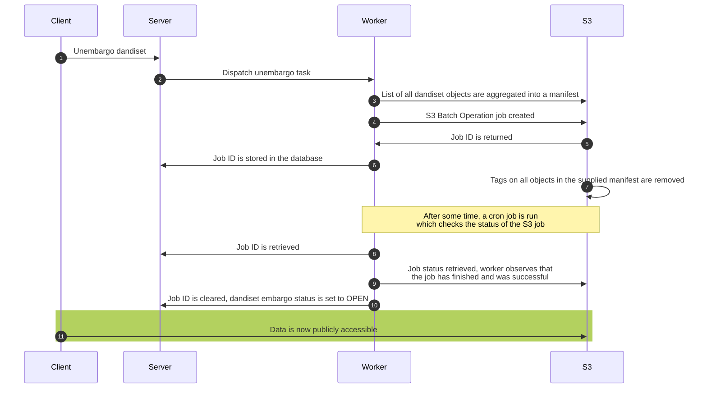

# Embargo Redesign

Author: Jacob Nesbitt

The current embargo infrastructure setup is both inefficient and prone to error, as we store embargoed data in one bucket, and regular data in another. This means that to unembargo data, it needs to be copied from one bucket to another, which not only costs money, but time as well. Plus, when it comes to the intersection of Zarrs and embargo (”Zarrbargo”), this approach is a non-starter. Therefore, a new approach is required.

## Problems with the Existing Approach

### Inefficiency

Embargoed data is currently uploaded to a bucket separate from the main sponsored bucket. Unembargoing involves copying data from that bucket into the sponsored bucket. Performing this copy by managing individual copy-object commands proved to show major performance issues due to the need for monitoring errors and from the sheer count of objects that need to be copied.

### Error-proneness

As Dandisets grow in size, comprising of more and more assets, the probability rises that the unembargo process—consisting of individually copying objects from bucket to bucket—will fail. While such failures are recoverable, that in turn requires further engineering efforts to make the process self-healing. This brings complexity and thus continued risk of failures for unembargo.

### Zarrbargo non-starterness

The drawbacks mentioned in the previous two sections are all compounded by Zarr archives, which have proven so far to bring data scales one or two orders of magnitude larger than non-Zarr data. The upload time for the largest Zarr we have processed was on the order of one month; copying such a Zarr over to the sponsored bucket would incur another period of time along the same order of magnitude.

Zarr archives, by nature, are made of many small files; Zarr archives of large size may expand to encompass 100000 files or more, raising the probability of a failure during unembargo.

## In-Place Object Tagging

With a simple bucket policy to deny public access to any object with an `embargoed` tag, the public access of an object can be restricted by simply adding the `embargoed` tag to that object.

```json
{
			"Effect": "Deny",
			"Principal": "*",
			"Action": "s3:*",
			"Resource": "arn:aws:s3:::dandiarchive/*",
			"Condition": {
				"StringEquals": {
					"s3:ExistingObjectTag/embargoed": "true"
				},
				"StringNotEquals": {
					"aws:PrincipalAccount": "769362853226"
				}
			}
		}
```

With this bucket policy enacted, by default, all data in the bucket remains public. However, if any objects contains the `embargoed=true` tag, it will be restricted from public access. If authorized users (dandiset owners, etc.) wish to obtain access, a pre-signed URL can be obtained from the API.

## Change to Upload Procedure

This new approach requires a change to the upload procedure, so that uploads to embargoed dandisets are tagged with the `embargoed` S3 tag. This can be achieved by adding the `embargoed=true` tag as part of the pre-signed put object URL that is issued to the user when uploading an embargoed file, such that if the ******client****** doesn’t include that tag, the upload will fail.

A diagram of the upload procedure is shown below



## Change to Unembargo Procedure

Once the time comes to *********unembargo********* those files, all that is required is to remove the `embargoed` tag from all of the objects. This can be achieved by an [S3 Batch Operations Job](https://docs.aws.amazon.com/AmazonS3/latest/userguide/batch-ops-create-job.html), in which the list of files is specified (all files belonging to the dandiset), and the desired action is specified (delete/replace tags).

The benefit of this approach is that once the files are uploaded, no further movement is required to change the embargo state, eliminating the storage, egress, and time costs associated with unembargoing from a second bucket. Using S3 Batch Operations to perform the untagging also means we can rely on AWS’s own error reporting mechanisms, while retrying any failed operations requires only minimal engineering effort within the Archive codebase.

### Object Tag Removal Workflow

1. [Create Job](https://boto3.amazonaws.com/v1/documentation/api/latest/reference/services/s3control/client/create_job.html) from celery task, storing the resulting Job ID in the dandiset model
2. Use a recurring celery task cron job to check any dandisets with a status of “unembargoing” and a not null “job ID” field, to see if they’ve finished using [describe_job](https://boto3.amazonaws.com/v1/documentation/api/latest/reference/services/s3control/client/describe_job.html)
3. Once an s3 batch job is found that’s completed, the manifest is downloaded from S3, to ensure that there were no failures
4. If there are no failures, the Job ID is set to null in the DB model, and the embargo status, metadata, etc. is updated to reflect that the dandiset is now `OPEN`.
5. Otherwise, an exception is raised and attended to by the developers.

A diagram of the unembargo procedure (pertaining to just the objects) is shown below



## Experimental Results

- Deleting tags of 10,000 objects took ~18 seconds
- Deleting tags of 100,000 objects took ~2 minutes

## Semantic Quirks of Embargo

During redesign deliberations, we noticed some oddities of how embargo might interact with deduplication in ways that raise some questions about the intended semantics of embargo. This section reviews some examples and states those questions for discussion and resolution among the full team.

### Embargoed Dandiset includes open asset

**Scenario.** Someone creates an open Dandiset 1, uploading asset A to it. They then create an embargoed Dandiset 2, also uploading asset A to that.

**Quirk.** Dandiset 2, though embargoed, contains an asset that is open and therefore world-readable. In spirit this contradicts the embargo on Dandiset 2.

**Remediation.** None needed, despite the apparent contradiction. Though Dandiset 2 contains a world-readable asset, no one who is not authorized to view the contents of Dandiset 2 knows that fact; for all they know, any data at all, *including open assets stored in the archive*, could be in that Dandiset. Thus, no excess information about Dandiset 2 is leaked.

### Open Dandiset includes embargoed asset

**Scenario.** Roughly the opposite of the last scenario: someone creates an *embargoed* Dandiset 3, uploading asset B to it. They then create an *open* Dandiset 4, also uploading B to that.

**Quirk.** Dandiset 4 now contains a hidden asset, which contradicts the openness of Dandiset 4 and seems to compromise the secrecy of Dandiset 3.

**Remediation.** There are a couple of ideas here:

1. **Don’t allow embargoed Dandiset assets to be used in open Dandisets.** At upload time, the API would simply refuse to allow hidden assets that are part of any embargoed Dandiset to be uploaded to an open Dandiset.

   This cuts the problem off at the root, but it is subject to a failure of our imaginations: perhaps there is a valid reason a neuroscientist would want to do this. One example: if a standard community tool exists that generates a skeleton Dandiset that includes something boilerplateish like a license file or copyright notice, people would regularly include those in embargoed Dandisets, and that could trigger this error condition somewhat baselessly.

   On the other hand, perhaps scientists would have a reason to want to include the same data in both an embargoed Dandiset and an open one. For instance, perhaps embargoed experiments are using some base but non-secret data within an embargoed Dandiset, and that same data needs to be part of an open Dandiset.

2. **Allow this type of sharing but force the user to provide an explicit flag to do so.** In this remediation, the user would receive a warning that they are trying to include embargoed data in an open Dandiset. The API / client would return an error with a prompt to retry with a `--force` type flag, which would then allow the upload to occur. The embargoed assets would become open to the public in the S3 bucket, and data access to the open Dandiset’s asset holding would occur in the usual manner.

The major questions here are:

- **Are the semantics valid of placing an embargoed asset in an open Dandiset?**
  *Answer:* Yes. Doing so causes the asset to become unhidden (see "chosen
	solution" section below).

- **Would a scientist ever want to push data to an embargoed Dandiset, and also
	to an open Dandiset?** *Answer:* Maybe, but it doesn't matter--if they do
	this, they'll be warned about their asset within their embargoed Dandiset
	becoming open, and they can act according to their own wishes.

**Chosen solution.** The solution is remediation (2) above: simply open
the asset up upon its upload to an open Dandiset after warning the uploader and
asking them to repeat the action with a `--force` flag.

The justification for this comes in two parts:

1. The user may be uploading "trivial" assets, such as autogenerated README
	 files, etc. These assets may indeed be hidden in the bucket if they are
	 uploaded to an embargoed Dandiset, but they are not "secret" in any
	 meaningful sense. Therefore, any other user that tries to upload such a file
	 does not violate the spirit of embargo by causing the asset in the bucket to
	 become unhidden.
2. The user may be uploading non-trivial assets, which is to say, an exact copy
	 of, e.g., experimental data already uploaded to an embargoed Dandiset. The
	 overwhelming, astronomic probability here is that this user is an owner of
	 the embargoed Dandiset--generating the exact same, bit-for-bit file "by
	 accident", while technically possible, just isn't going to happen. So in this
	 case, we can safely assume that the uploader has the moral right to cause the
	 asset to become unhidden and merely needs to be reminded that that is what
	 they are about to do.

### Two embargoed Dandisets include a shared embargoed asset

**Scenario.** Someone creates embargoed Dandisets 5 and 6, uploading asset C to each. Then, they unembargo Dandiset 6, leading to a scenario similar to the previous one.

**Quirk.** This is the same state as the previous scenario, but the same remediations do not seem to apply. Disallowing the unembargo operation is a nonstarter because that leads to a sort of deadlock: there would be no way to unembargo Dandisets 5 and 6. And forcing the user to explicitly include a flag does not help since we still end up in that deadlock situation. Furthermore, the questions about intent do not come up here: it seems reasonable that a scientist would indeed prepare two Dandisets with a shared, embargoed asset.

**Remediation.** In this case, it seems that we need to allow for unembargo and fall back to the situation described above, where access to the asset is granted through presigned URLs, without otherwise disclosing the fact that the asset is still present in another embargoed Dandiset. A warning to the user on their attempt to unembargo may be warranted so they can decide if they want to expose that asset while it is still under embargo in the other Dandiset.

Finally, this brings up a question about when to remove the `embargoed` tag from the object in the S3 bucket: we would insert logic to detect whether the embargoed asset is included in any other embargoed Dandisets, and only trigger the tag removal if there are none. This brings up one major question:

- **Do these situations nullify the effect/need to keep data hidden in the
	bucket at all?** *Answer:* No. Because users are warned about hidden assets
	becoming unhidden, they can decide how to proceed according to their own
	needs. Furthermore, assets in an embargoed Dandiset remain embargoed, in that
	the embargoed Dandiset will not show unauthorized users that asset, even if it
	becomes available in the bucket.

**Chosen solution.** In this case, as above, we simply warn the user that the
Dandiset contains assets that are also in another Dandiset, then go on to unhide
the asset in the bucket in the course of unembargoing, e.g., Dandiset 6.

### Summary

The quirks we noticed have to do with DANDI's approach to deduplication of data.
The semantics we are adopting do not rigidly constrain "embargoed" assets to
remain always hidden *in the bucket*, since they may continue to be hidden from
view within their home Dandiset (if a given Dandiset is under embargo, for
example). The approach eliminates the problematic user stores listed above, and
it has the advantage of simplicity as well, while reasonably preserving the
secretive nature of embargoed Dandisets.

## A Note on Future Work

The concept of "embargo" originates with NIH and its offer of a period in which
researchers can conduct studies and publish results without fear of being
scooped, in exchange for committing to publish their data after that embargo
period; as such, it is a somewhat complex collection of functionality that rests
upon the ability to hide objects in DANDI's S3 bucket.

Other upcoming features that users have asked for, such as the ability to upload
"restricted" data (i.e., data that is viewable freely by users authorized do so
generally, but no others), will also make use of some of the rudimentary
elements that are driving this embargo design.
