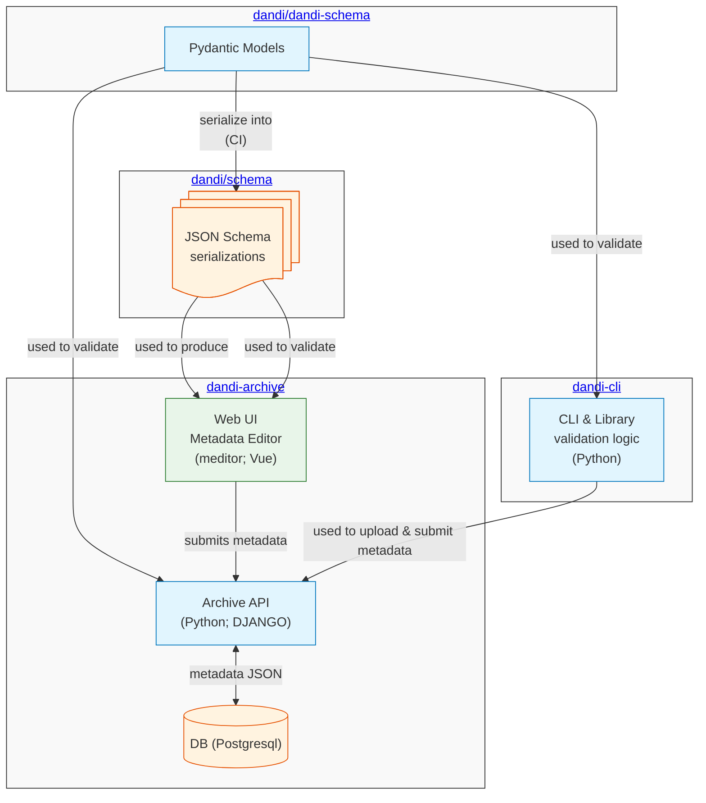
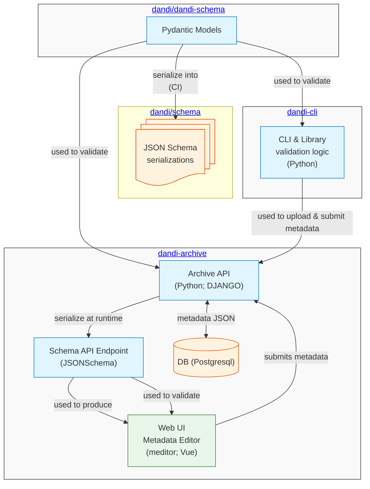

# Vendor-Configurable Metadata Models

This document illustrates the limitations originate from the metadata models in the DANDI ecosystem with
[dandi-schema](https://github.com/dandi/dandi-schema) before version 0.12.0 and outlines the solution
of vendor-configurable metadata models implemented across multiple components of the ecosystem,
with the implementation starting and coordinated with dandi-schema at v0.12.0, to overcome these
limitations.

## Limitations

The current metadata models and their uses in the DANDI ecosystem have the following limitations:

1. We do not actually support or use multiple versions of the metadata models in dandi-archive.
2. We use two representations of metadata models – Pydantic models and their respective JSON Schema derivatives – and
   rely on an external process to generate the JSON Schema representation from the Pydantic models.
3. We manually trigger updates of web frontend files according to a specific version of the JSON Schema representation of the models.
4. We hardcode vendor-specific information inside the dandi-archive codebase (backend and frontend).
5. Any vendor-specific configuration done at runtime in Pydantic models is not reflected in the JSON Schema representation used
   by the web frontend since the web frontend uses a static versioned JSON Schema representation stored at
   [dandi/schema](https://github.com/dandi/schema) that has been generated by the external process mentioned in point 2.

> The diagram above depicts how metadata models are defined, represented, and used in the DANDI ecosystem before version 0.12.0 of dandi-schema.

## Solution to Overcome Limitations

The solution of vendor-configurable metadata model addresses the limitations outlined above by implementing the following changes:

1. Make the metadata models vendor-configurable in dandi-schema.
2. Create an API endpoint at `/api/schemas/` in dandi-archive to distribute dynamically generated JSON Schema representations of the metadata models
   from the Pydantic models that define the metadata models at runtime.
3. Update the `/api/info/` endpoint at dandi-archive
   1. to point to the endpoint in point 2 for retrieving a JSON Schema representation of the metadata models
      instead of a static versioned JSON Schema representation stored at [dandi/schema](https://github.com/dandi/schema).
   2. to include vendor-specific information.
4. Remove any hardcoded vendor-specific information in dandi-archive, and use the vendor-specific configuration
   provided by dandi-schema.
5. Have clients, such as the web UI (meditor), use the endpoints in point 2 and 3 to retrieve vendor-specific configurations
   and JSON Schema representations of the metadata models that match the metadata models used by the particular instance of dandi-archive.

> The diagram above depicts how metadata models are defined, represented, and used in the DANDI ecosystem starting with version 0.12.0 of dandi-schema.

### Benefits

This implementation provides several benefits:

1. **Runtime Consistency**: The schema used by the frontend will always match the one used by the backend, including any vendor-specific configurations.
2. **Simplified Deployment**: No need to manually update JSON Schema files or manage the [dandi-schema](https://github.com/dandi/dandi-schema) repository for storing
   JSON Schema representations of the metadata models.
3. **Future-Proofing**: The implementation allows for future support of multiple schema versions if needed.
4. **Reduced Dependencies**: Removes the dependency on external GitHub URLs for schema definitions.

### Immediate Steps and Longer-Term Opportunities

The immediate implementation supports distributing, through an API endpoint, the JSON Schema representations of only the vendor-configurable metadata models currently being used
by the particular instance of dandi-archive. However, the API endpoint has been structured to allow support for multiple versions of JSON Schema representations in the future if needed.

Additionally, the JSON-LD context.json could also be similarly generated and served by the backend if needed in the future.
