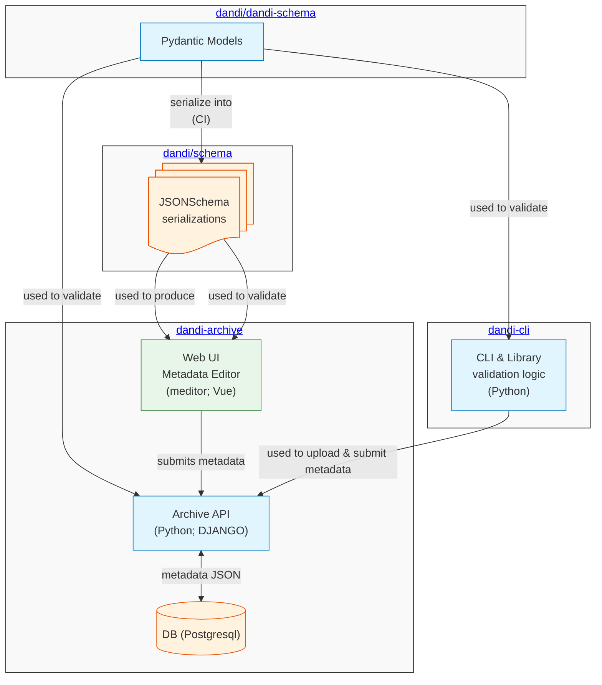
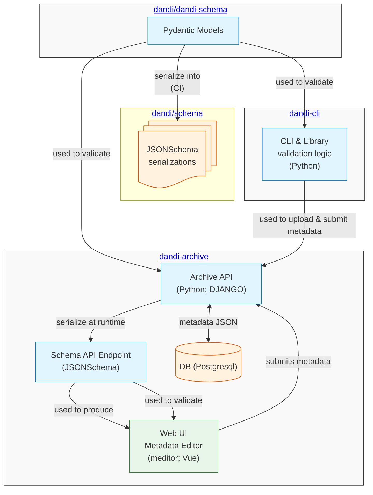

# Access to JSONSchema serialization of dandi-schema dandiset.json

## Current situation

This mermaid diagram depicts current overall definition and flow of the metadata schema:



In summary, dandi-archive relies on two *instantiations* of `dandi-schema`:

- **Pydantic**: backend validates metadata using Python library;
- **JSONSchema**: frontend is produced with validation of entry against loaded from JSONSchema serialization definitions.

### Pydantic models: backend

The JSONSchema models are generated from the Pydantic models in the `dandi-schema` repository, and stored in `dandi/schema` repository for every version of `dandi-schema` Pydantic model.
The idea was to be able to validate against specific version of the `dandi-schema` model.
AFAIK it was never realized and `dandi-archive` always uses specific version of the `dandi-schema` model, as prescribed by the `DANDI_SCHEMA_VERSION` constant [in `dandischema.consts`](https://github.com/dandi/dandi-schema/blob/HEAD/dandi-schema/consts.py) with possibility to overload in [dandiapi.settings](https://github.com/dandi/dandi-archive/blob/HEAD/dandiapi/settings.py#L98C1-L101C85).

```python
from dandischema.consts import DANDI_SCHEMA_VERSION as _DANDI_SCHEMA_VERSION

class DandiMixin(ConfigMixin):
    ...
    # This is where the schema version should be set.
    # It can optionally be overwritten with the environment variable, but that should only be
    # considered a temporary fix.
    DANDI_SCHEMA_VERSION = values.Value(default=_DANDI_SCHEMA_VERSION, environ=True)
```

and us hardcoding to use very specific version of `dandi-schema` in the `dandi-archive` repository's [`setup.py`](https://github.com/dandi/dandi-archive/blob/HEAD/setup.py)

```python
        # Pin dandischema to exact version to make explicit which schema version is being used
        'dandischema==0.11.0',  # schema version 0.6.9
```

Then we use `dandischema` library to validate the metadata in the backend (via celery tasks AFAIK) and against both Pydantic and JSONSchema models

```python
❯ git grep -e 'validate(' -e 'import.*validate\>' dandiapi/api/services/
dandiapi/api/services/metadata/__init__.py:from dandischema.metadata import aggregate_assets_summary, validate
dandiapi/api/services/metadata/__init__.py:            validate(metadata, schema_key='PublishedAsset', json_validation=True)
dandiapi/api/services/metadata/__init__.py:            validate(
dandiapi/api/services/publish/__init__.py:from dandischema.metadata import aggregate_assets_summary, validate
dandiapi/api/services/publish/__init__.py:        validate(new_version.metadata, schema_key='PublishedDandiset', json_validation=True)
```

### Web frontend (Vue)

Uses JSONSchema model via vjsf to produce WebUI.
Unclear though if we are up-to-date since

```python
❯ head -n4 web/src/types/schema.ts
/**
 * This file was automatically generated by json-schema-to-typescript.
 * DO NOT MODIFY IT BY HAND. All changes should be made through the "yarn migrate" command.
 * TypeScript typings for dandiset metadata are based on schema v0.6.2 (https://raw.githubusercontent.com/dandi/schema/master/releases/0.6.2/dandiset.json)
```

although we already use v0.6.9 of dandischema.

Web frontend then takes the `schema_url` from `/info` URL (thus JSONSchema serialization from `dandi/schema` repository) and loads it to `.schema` in [dandiset.ts](https://github.com/dandi/dandi-archive/blob/master/web/src/stores/dandiset.ts#L109).

### Vendorization

Initial motivation for this PR/design document was de-re-vendorization of DANDI instances with initial changes in the [dandi-schema:PR#294](https://github.com/dandi/dandi-schema/pull/294).
See [dandi-archive:issue#2382](https://github.com/dandi/dandi-archive/issues/2382) for more information on de-re-vendorization of dandi-archive.


### Summary

We
- do neither support nor use multiple versions of the schema in dandi-archive
- use two instantiations of the schema and rely on external process to generate JSONSchema from Pydantic models
- manually trigger update of web frontend files according to some version of the schema
- hardcoded some vendorization inside the dandi-archive codebase (backend and frontend)
- **any vendorization done via Configuration at runtime for Pydantic, is not reflected in the JSONSchema serialization used by the web frontend since loaded from a generic serialization!**


## Proposed solution

### Summary

The overall idea is to remove use/reliance on https://github.com/dandi/schema/ JSONSchema serializations and to perform serialization to be used by the frontend, by directly serializing needed JSONSchema at the backend startup time, thus accounting for possible vendorization, or upon a request of an API (public or not) call.

### Updated Architecture

This mermaid diagram depicts the proposed changes to the flow of metadata schema:



Key changes:
1. The separate JSONSchema repository is no longer used
2. Schema API endpoints in dandi-archive dynamically generate JSONSchema from Pydantic models
3. The web UI (meditor) uses the locally generated schema instead of GitHub hosted schema
4. Any vendorization done at runtime is automatically reflected in the JSONSchema

### Details

- add the following endpoints API endpoints:
    - `/api/schemas/available/` - Returns the list of available schema models that can be used as a query parameter value for the `/api/schemas/` endpoint
    - `/api/schemas/` - Returns the JSONSchema for a queried model specified with the `model` query parameter (e.g., `?model=Dandiset`)
        - Currently, this endpoint only returns the schema of the queried model at the latest version. In the future, it could be extended to support different versions with a `version` query parameter.
        - In the future, this can be extended to support request of different content type. Currently, [application/schema+json](https://json-schema.org/draft/2020-12/json-schema-core#section-14) is supported, providing JSONSchema serialization
- `schema_url` in `/info` should point to that instance's `/api/schemas/?model=Dandiset` URL , thus web frontend would load that schema from the backend/API instead of relying on the static JSONSchema serialization in a separate `dandi/schema` repository.

## Additional considerations

### s3://dandiarchive/schema/

As all of our data is on `dandiarchive` s3 bucket, I wonder if while refactoring our use of JSONSchema serializations, we should implement mirroring of `dandi/schema` repository under `s3://dandiarchive/schema/` and point to `context.json` from there instead of GitHub.
Mirroring could be implemented via `git annex exporttree` from the `dandi/schema` repository.
