# Zarr Upload Process Simplification

Due to the size of Zarr archives, and specifically the number of small files
they comprise, our existing design for the Zarr upload process fails to adhere
to some implicit assumptions that lead to poor performance, both of Zarr uploads
themselves, and the overall system. This proposal simplifies the process to gain
high performance while improving data integrity guaraentees and preserving
algorithmic correctness.

The proposed improvement revolves around eliminating the upload batching
bottleneck and replacing its functions with other, more performant actions
elsewhere in the process.

## Current Process

To summarize the current state of Zarr upload, refer to this sequence diagram:

```mermaid
sequenceDiagram
    autonumber

    participant S3
    participant Client as dandi-cli
    participant Server
    participant Worker

    Client->>+Server: Create a Zarr Archive
    Server-->>-Client: PENDING Zarr Archive

    loop for each batch of <= 255 files
        Client->>+Server: Create an Upload w/ list of file paths/etags
        Server-->>-Client: An Upload with a set of signed URLs
        loop for each file
            Client->>+S3: Upload individual file using signed URL
        end
        Client->>+Server: Finalize Upload (verify file presence and etag matching) 🐢 🐢 🐢
        Server-->>-Client: PENDING Zarr Archive
    end

    Client->>+Server: Ingest Zarr Archive

    rect rgb(179, 209, 95)
        Server->>+Worker: Compute tree checksum for Zarr Archive
    end

    loop
        Client->>+Server: Check for COMPLETE Zarr Archive
        Server-->>-Client: PENDING/INGESTING/COMPLETE Zarr Archive
    end
```

The process is as follows.

(Steps 1 and 2): `dandi-cli` asks the server to create a new Zarr archive, which is put into the `PENDING` state.

(Steps 3 and 4): For each batch of (maximum) 255 Zarr chunk files the client wants to upload, `dandi-cli` asks the server to create an `Upload`, supplying the list of file paths and associated etags, and receiving a list of signed upload URLs.

(Step 5): `dandi-cli` uses these URLs to upload the files in that batch.

(Steps 6 and 7): Then, `dandi-cli` asks the server to finalize the batch, and the server does so, matching etags and verifying that all files were uploaded. *This step is very costly, due to the server's need to contact S3 to verify these conditions.*

(Step 8): When all batches are uploaded, `dandi-cli` signals the server to ingest the Zarr archive.

(Step 9): The server kicks off an asynchronous task to compute the treewise Zarr checksum.

(Steps 10 and 11): Meanwhile, `dandi-cli` sits in a loop checking for the Zarr archive to reach a `COMPLETE` state.

### Performance Problem: Slow and Serial Upload Finalization

The major performance problem with the existing design is the *slow* and
*serial* upload batch finalize operation (step 6). The slowness comes from
sending a `HEAD` request for every S3 object in the upload batch to verify its
existence and check its etag against that of the file the client sent.

Furthermore, the need to finalize a batch before starting a new one makes the
verification of existence and checksum an essentially serial process. Together,
this means that Zarr archives with a large number of files will consume quite a
bit of time.

The proposed design solves these flaws while still providing data integrity and
existence guarantees.

## Proposed Process

The proposed process is largely the same as the existing process; in the
following description, changed steps will be listed in **bold**.

(Step 1): **`dandi-cli` computes the Zarr checksum locally**.

(Steps 2 and 3): `dandi-cli` asks the server to create a new Zarr archive, which is put into the `PENDING` state.

(Steps 4 and 5): **`dandi-cli` will request a presigned upload URL from the server for each Zarr chunk file**.
Important notes:
* For an existing zarr archive, this is where the upload process begins, as requesting a signed url for upload will always place the zarr archive into a `PENDING` state.
* While there is no longer an explicit concept of an "upload batch", there is still a maximum number of presigned upload URLs that can be returned from a single request. This number is currently 255.

(Step 6): `dandi-cli` uses these URLs to upload the files **using S3's `Content-MD5` header to verify the uploaded file's integrity**. **Instead of finalizing a batch (since there is no longer a batch concept), `dandi-cli` repeats these steps until all files are uploaded (repeating steps 4, 5, and 6).** (Note that `dandi-cli`'s actual strategy here may be more nuanced than a simple loop as depicted above; instead, it might maintain a queue of files and a set of files "in flight", replenishing them according to some dynamic batching strategy, etc. In any such strategy, some combination of steps 4, 5, and 6 will repeat until all files are uploaded.)

(Steps 7 and 8): **`dandi-cli` asks the server to finalize the Zarr**.

(Step 9): The server kicks off an asynchronous task to compute the treewise Zarr checksum, updating the status of the Zarr once it's finished.

(Steps 10 and 11): Meanwhile, `dandi-cli` sits in a loop checking for the Zarr archive to reach the `COMPLETE` state.

### Benefits

Note that in this approach:

1. S3 takes on the burden of verifying that the file arrived in the bucket
   correctly, saving on long-latency `HEAD` requests to S3 after the fact.
2. Batches of uploaded files do not need to be serially verified before a new
   batch of uploads can begin.
3. A final check for full Zarr archive integrity is performed by comparing
   checksums rather than individual files, enabling a fast and low-latency check
   before the Zarr archive is put into the `COMPLETE` state.

Additionally, the proposed process is dramatically simpler than the existing
one, which means fewer errors can creep into the codebase and runtime execution,
and it is less prone to performance issues by avoiding the need for, e.g.,
database locks etc.

The required changes to the software are:

- In `dandi-archive`:
    - the logic for verifying upload batches will be removed;
    - the logic for computing checksums will be generalized to work on both S3
    objects and local files; and
    - that logic will be refactored into a shared Python library.
- In `dandi-cli`:
    - the local Zarr checksum needs to be computed (using the shared Python
    library for doing so);
    - (optionally) a new strategy for managing a set of signed URLs needs to be
    implemented (though the current strategy of managing statically sized
    batches will work); and
    - a comparison between the server-computed and locally-computed checksums
    needs to be made.

## Error Handling

In the overwhelming majority of cases, the proposed process will result in a
successful Zarr upload. This is due to a combination of using S3's data
integrity guarantees (to verify that all uploaded bytes arrived properly) and
verifying a full checksum on the client and server's version of the uploaded
Zarr (to guarantee that all required files were uploaded to the correct
locations).

In the rare case that something does go wrong (indicated by a non-matching Zarr
checksum in the final step of the process), the algorithm for recovery involves
the client asking the API for the list of all objects currently stored in the
Zarr in question, then comparing that list with the local list of Zarr chunk files
for both existence and matching checksum. Any files with an incorrect checksum can
be removed from S3 and then reuploaded; any missing files can simply be uploaded.

A variant of this algorithm can be used for resuming an interrupted upload
process: skip the checksum comparison and only look for files that have not yet
been uploaded. Other variants can be used to, e.g., upload a locally changed
Zarr, etc.

It is worth repeating: the need for this error handling mechanism is generally
expected to almost never be needed; but it is possible to run this algorithm to
correct any errors that do arise.

## Execution

Only small changes are needed to the `dandi-cli` codebase to bring it in line
with this proposal. Some of the work in `dandi-archive` has already been done,
and the rest is on par with the changes needed for `dandi-cli`. If all concerns
with the plan are allayed, then it should not be difficult to execute the plan
and gain significant performance for Zarr upload.

---
## Previous Design

We previously included extra functionality, which involved *including* the locally computed checksum when finalizing the zarr archive (step 7), and adding a `MISMATCH` state to the zarr `status` field, which would be set if the checksum produced by the asynchronous zarr checksum task didn't match the checksum provided in step 7.

This addition was later reverted in the interest of simplicity, as well as the fact that it is functionally equivalent to the current design.
